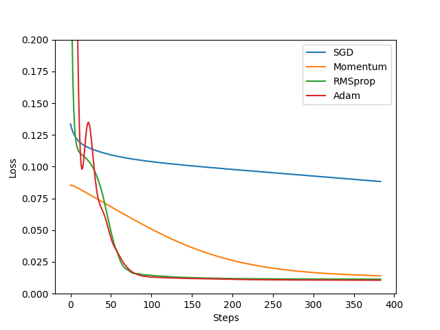

# PyTorch之神经网络

> 目前所知建立神经网络的两种方法，第一种是创建一个神经网络类class，编写传递参数和调用激励函数，第二种是直接使用`torch.nn.Sequential`快速创建神经层，效果一样方式不同。以后有其他方式再添加^-^

## 方式一

> 在`__init__()`中定义层结构，再在`forward()`中搭建层与层之间的关系链接，建立关系链接的时候会用到激励函数，下面例子中使用的是relu函数。

```py
class Net(torch.nn.Module):

    def __init__(self, n_feature, n_hidden, n_output):
        super(Net, self).__init__()
        self.hidden = torch.nn.Linear(n_feature, n_hidden)  # 隐藏层线性输出
        self.predict = torch.nn.Linear(n_hidden, n_output)  # 输出层线性输出

    def forward(self, x):  # 重写Module中forward功能
        # 正想传播输入值，神经网络分析出输出值
        x = F.relu(self.hidden(x))  # 激励函数（隐藏层的线性值）
        return self.predict(x)  # 输出值
```

## 方式二

> `torch.nn.Sequential`创建与上述Net的class方式层创建基本一致，只不过是都在`Sequential`方法中实现了，下面看一下快速搭建的方式：

```py
net = torch.nn.Sequential(
        torch.nn.Linear(n_feature, n_hidden),
        torch.nn.ReLU(),
        torch.nn.Linear(n_hidden, n_output)
    )
```

## 训练神经网络

```py
# optimizer 优化器的意思
optimizer = torch.optim.SGD(net.parameters(), lr=0.5)  # 传入net的所有参数，学习率
loss_func = torch.nn.MSELoss()  # 用在回归问题：预测值和真实值的误差计算公式

for t in range(100): # 循环创建100步的学习计划
    prediction = net(x)  # 喂入训练数据x，输出预测值
    loss = loss_func(prediction, y)  # 计算预测值和实际值的误差
    #  优化步骤
    optimizer.zero_grad()  # 清空上一步的残余更新参数值
    loss.backward()  # 误差反向传播，计算参数更新值，计算梯度
    optimizer.step()  # 将参数值指甲刀net的parameters上，优化梯度
```

- optimizer 优化器的意思
- 训练工具：`torch.optim.SGD(net.parameters(), lr=0.2)`
  - `SGD`是算法优化器的一种，但不是最好的，后面会介绍更多的优化器
  - `lr`参数值一般小于1，数值越大计算学习效率越快
- 用均方差计算回归的误差：`torch.nn.MSELoss()`
- `oss_func(prediction, y)`计算预测值和实际值的误差，一般预测值在前，实际值在后，调换的话误差会有不同。
- `optimizer.zero_grad()`：优化所有神经元的参数，先将所有梯度降为0
- `loss.backward()`：根据误差反向传递，计算出梯度信息
- `optimizer.step()`：将梯度以`lr=0.5`上传，再优化梯度

### 关系拟合(回归)

- 用均方差计算回归的误差：`torch.nn.MSELoss()`

### 区分类型(分类)

- 适用分类的误差计算：`torch.nn.CrossEntropyLoss()`

## 训练模型提取保存

- `torch.save(net1, 'net1.pkl')` 保存神经网络
- `torch.save(net1.state_dict(), 'net1_params.pkl')` 保存神经网络层之间参数
- `torch.load('net1.pkl')` 提取神经网络
- `net3.load_state_dict(torch.load('net1_params.pkl'))` 加载神经网络层之间参数

```py

# 保存在上述笔记训练结束后直接调用torch.save进行保存，两种保存方式如下：

torch.save(net, 'net.pkl')
torch.save(net.state_dict(), 'net_params.pkl')

# 两种方式提取如下：

def restore_net():
    net2 = torch.load('net1.pkl')

def restore_params():
    net3 = torch.nn.Sequential(
        torch.nn.Linear(1, 10),
        torch.nn.ReLU(),
        torch.nn.Linear(10, 1)
    )
    net3.load_state_dict(torch.load('net1_params.pkl'))
```

## 批训练

- 将大数据集进行拆分，分批次多进程或者多线程进行处理，优化学习速率。
- 引入torch中的data包`import torch.utils.data as Data`
- `Data.TensorDataset(x, y)` 传入**输入和输出**数据集
- `Data.DataLoader` 加载批训练数据集，设置相关参数
- `batch_size` 缓冲池大小
- `shuffle` 是否随机提取数据
- `num_workers` 两个进程进行工作

```py
x = torch.linspace(1, 10, 10)
y = torch.linspace(10, 1, 10)
BATCH_SIZE = 5

torch_dataset = Data.TensorDataset(x, y)
loader = Data.DataLoader(
    dataset=torch_dataset,
    batch_size=BATCH_SIZE,
    shuffle=True,
    num_workers=2
)

for s in range(2):
    for i, (batch_x, batch_y) in enumerate(loader):
        # 打出来一些数据
        print('Epoch: ', s, '| Step: ', i, '| batch x: ',
                batch_x.numpy(), '| batch y: ', batch_y.numpy())
```

### 加速神经网络训练

- SGD：Stichastic Gradient Descent
- 更新神经网络参数
  - 传统的参数 W 的更新是把原始的 W 累加上一个负的学习率(learning rate) 乘以校正值 (dx).: W += -Learning rate * dx
- Mnmentum 
  - m = b1 * m -Learning rate * dx
  - W += m
- AdaGrad
  - v += dx^2
  - W += -Learning rate * dx / sqrt(v)
- RMSProp
  - v = b1 * v + (1-b1) * dx^2
  - W += -Learning rate * dx / sqrt(v)
- Adam
  - m = b1 * m + (1-b1) * dx
  - v = b2 * v + (1-b2) * dx^2
  - W += -Learning rate * m / sqrt(v)

## 优化器：Optimizer

> 作用是把神经网络中的参数一个个的优化掉。

- 上面笔记中提到一种优化器：SGD
  - `torch.optim.SGD(net.parameters(), lr=0.2)`
  - 全称：`Stochastic Gradient Descent`
- Momentum优化器：`torch.optim.SGD(net.parameters(), lr=LR, momentum=0.8)`
- RMSprop优化器：`torch.optim.RMSprop(net.parameters(), lr=LR, alpha=0.9)`
- Adam优化器：`torch.optim.Adam(net.parameters(), lr=LR, betas=(0.9, 0.99))`

