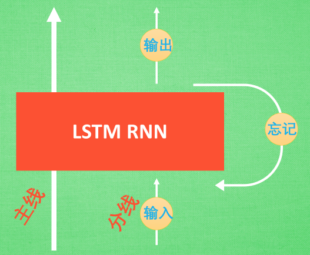

# 高级神经网络

## 卷积神经网络CNN

> 卷积神经网络在图像和语音识别上能有给出更优的预测结果，例如图像识别、视频分析、自然语言处理、药物发现等等。

### 卷积

> 卷积：举例获取连续的小片图片的像素进行处理，使得神经网络可以看到图片而不是像素点，可以更好的理解图片。

- 不断的卷积小像素块，获取更多的边缘信息，使得高度增加
- 再次卷积，高度再增加、就会对图片有更深的理解
- 增高的信息嵌套在普通的分类的神经层上。就能对这种图片进行分类了

### 池化(pooling)

> 研究发现在卷积的过程中神经网络会丢失掉一些信息，池化则可以很好的解决此问题。

- 池化是一个筛选过滤的过程；
- 能将layer中有用的信息保留下来，给next layer分析；
- 池化同时可以减轻神经网络的计算负担；
- 通俗的理解是：卷积的时候不压缩长和宽、尽量保留更多的信息，压缩工作交给池化；

### 流行的CNN结构


```flow
st=>start: 图片(image)
op1=>operation: 卷积层 (convolution)
op2=>operation: 池化(pooling)
op3=>operation: 卷积层 (convolution)
op4=>operation: 池化(pooling)
op5=>operation: 神经层 (fully connected)
op6=>operation: 神经层 (fully connected)
op7=>operation: 分类器(classifier)
e=>end: 结束
st->op1->op2->op3->op4->op5->op6->op7->e
```

## 使用CNN卷积神经网络Base

使用CNN卷积神经网络对MNIST数据进行图片数字识别，主要分为几个步骤：

1. 获取MNIST数据集；
2. 搭建CNN神将网络，完全安装上述流程图来创建；
3. 训练数据集，通过验证级输出训练程度；

下面分别上代码，并且注释说明相关内容。

### 获取训练集和测试集

```py
# torchvision 包含了一些常用的训练数据集
train_data = torchvision.datasets.MNIST(
    root='./mnist',  # 存放到mnist路径
    transform=torchvision.transforms.ToTensor(),  # 转换成tensor格式
    train=True,  # 获取的是否是训练数据集
    download=True  # 是否需要下载，若果是False则直接从mnist目录获取
)

# 上面下载完数据集，测试数据集就可以不用下载直接加载了
test_data = torchvision.datasets.MNIST(
        root='./mnist', train=True)  
```

### 搭建神经网络

```py
class CNN(nn.Module):

    def __init__(self):
        super(CNN, self).__init__()
        self.conv1 = nn.Sequential(  # 第一次卷积和池化，输入数据 -> (1, 28, 28)
            nn.Conv2d(
                in_channels=1,  # 输入数据值，第一次高度为1
                out_channels=16,  # 每个像素块获取16次，将高度增加到16
                kernel_size=5,  # 每个卷积像素宽度为5
                stride=1,  # 每次卷积前进为1个像素
                padding=2),  # 卷积到边缘时，剩余宽度小于5，则通过padding用0填充
                #  如果想要 con2d 出来的图片长宽没有变化, padding=(kernel_size-1)/2 当 stride=1
                # 输出数据 -> (16, 14, 14)
            nn.ReLU(),
            nn.MaxPool2d(kernel_size=2))
        self.conv2 = nn.Sequential(  # 第二次卷积和池化，输入数据 -> (16, 14, 14)
            nn.Conv2d(16, 32, 5, 1, 2),
            nn.ReLU(),
            nn.MaxPool2d(kernel_size=2))  # -> (32, 7, 7)
        self.out = nn.Linear(32 * 7 * 7, 10)  # 输出层数据量为10个，代表(0~9)十种类型

    def forward(self, x):
        x = self.conv1(x)
        x = self.conv2(x)
        x = x.view(x.size(0), -1)  # 展平多维的卷积图成 (batch_size, 32 * 7 * 7)
        output = self.out(x)
        return output
```

### 训练神经网络

```py
cnn = CNN()
optimizer = torch.optim.Adam(cnn.parameters(), lr=LR)
loss_func = nn.CrossEntropyLoss()

for step, (batch_x, batch_y) in enumerate(train_loader):
    out = cnn(batch_x)
    loss = loss_func(out, batch_y)
    optimizer.zero_grad()
    loss.backward()
    optimizer.step()

    if step % 50 == 0:
        test_out = cnn(test_x)
        pred_y = torch.max(test_out, 1)[1].data.squeeze()
        accuracy = sum(pred_y == test_y) / test_y.size(0)
        print(step, loss.data.numpy(), '%.2f' % accuracy)
```

## RNN 循环神经网络

> RNN神经网络区别于CNN神经网络，更注重于解决时序性问题，常被用于时序预测等问题上（回归），也可以解决时序性的分类问题，但是对于图片的分类效果不如CNN好一些。在序列分析上，RNN会将上一步神经网络的状态传递给当前状态，将每一步的状态（记忆）进行关联起来。


> 每次 RNN 运算完之后都会产生一个对于当前状态的描述，state. 我们用简写 S( t) 代替，然后这个 RNN开始分析 x(t+1)，他会根据 x(t+1)产生s(t+1)，不过此时 y(t+1) 是由 s(t) 和 s(t+1) 共同创造的。所以我们通常看到的 RNN 也可以表达成这种样子。

- 语言情感色彩分析；
- 图片描述分析；
- 语言翻译；

### LSTM-RNN (long-short term memory)

> `LSTM`是`long-short term memory`的简称，中文叫做【长短期记忆】，是当下最流行的`RNN`形式之一。

#### RNN的缺点

> 由于RNN会对长期状态(记忆)有遗失现象，比图一段很长的话，关键词在开头出现，在最后时间点得出误差，然后再分析开头出现的关键词则需要反向传递误差，而且在**反向传递**得到的误差的时候，在每一步都会**乘以一个自己的参数 W**，如果这个**W**是一个小于**1**的数，比如**0.9**。这个**0.9不断乘以误差**，误差传到初始时间点也会是一个接近于零的数，所以对于初始时刻**误差相当于就消失了**，我们把这个问题叫做`梯度消失`或者`梯度弥散 Gradient vanishing`。反之如果**W**是一个大于**1**的数，比如**1.1 不断累乘**，则到最后变成了**无穷大的数**，RNN被这无穷大的数撑死了，这种情况我们叫做`剃度爆炸 Gradient exploding`。 这就是普通`RNN`没有办法回忆起久远记忆的原因。

##### 梯度弥散(梯度消失)


##### 梯度爆炸


#### LSTM-RNN优势

> `LSTM`和普通`RNN`相比，多出了三个控制器。(**输入控制**，**输出控制**，**忘记控制**)。

- 输入控制：会将对结果有重要影响的内容进行记录**输入到主线上**；
- 忘记控制：如果新内容对结果的重要影响**大于之前在主线上**记录的部分内容，则忘记之前主线上的部分内容，记录新的内容；
- 输出控制：会根据最终记录的时序信息输出要达到的预期结果。



#### 基于RNN的图片分类

```py
class RNN(nn.Module):
    def __init__(self):
        super(RNN, self).__init__()
        self.rnn = nn.LSTM(  # 图片分类LSTM效果更好
            input_size=28,  # 输入数据，图片像素点
            hidden_size=64,  # 神经元个数
            num_layers=1,  # 有几个神经层
            batch_first=True # input&output会是以batch size为第一维度的特征集 e.g. (batch, time_step, input_size)
        )
        self.out = nn.Linear(64, 10)  # 输出

    def forward(self, x):
        # x shape (batch, time_step, input_size)
        # r_out shape (batch, time_step, output_size)
        # LSTM 有两个 hidden states, h_n 是分线, h_c 是主线
        # h_n shape (n_layers, batch, hidden_size) 
        # h_c shape (n_layers, batch, hidden_size)
        r_out, (h_n, h_c) = self.rnn(x, None)

        # 选取最后一个时间点的 r_out 输出
        # 这里 r_out[:, -1, :] 的值也是 h_n 的值
        out = self.out(r_out[:, -1, :])
        return out
```

#### 基于RNN的回归预测

```py
class RNN(nn.Module):

    def __init__(self):
        super(RNN, self).__init__()
        self.rnn = nn.RNN(  # 没用LSTM是因为这个回归比较基础，RNN就足够了
            input_size=INPUT_SIZE,
            hidden_size=32,
            num_layers=1,
            batch_first=True)
        self.out = nn.Linear(32, 1)

    def forward(self, x, h_state):
        # h_state 是上一步的状态值
        r_out, h_state = self.rnn(x, h_state)
        outs = []
        for step in range(r_out.size(1)):
            outs.append(self.out(r_out[:, step, :]))
        return torch.stack(outs, dim=1), h_state  # 返回值包含当前状态值，传给下一步进行分析使用
```

## 自编码(AutoEncoder)

> 通过搭建的神经网络对数据进行训练，将输入的信息提取出预定的特征，并且根据提取的特征能很好的还原出原始数据信息，此模型即为自编码。
通过将原数据`白色的X`压缩，解压成`黑色的X`，然后通过对比`黑白 X`，求出预测误差，进行`反向传递`逐步提升自编码的准确性。训练好的自编码中间这一部分就是能总结原数据的精髓。可以看出`从头到尾`我们只用到了`输入数据X`，并没有用到`X`对应的数据标签，所以也可以说自编码是`一种非监督学习`。
到了真正使用自编码的时候，通常只会用到自编码前半部分。


### 自编码-图片压缩

